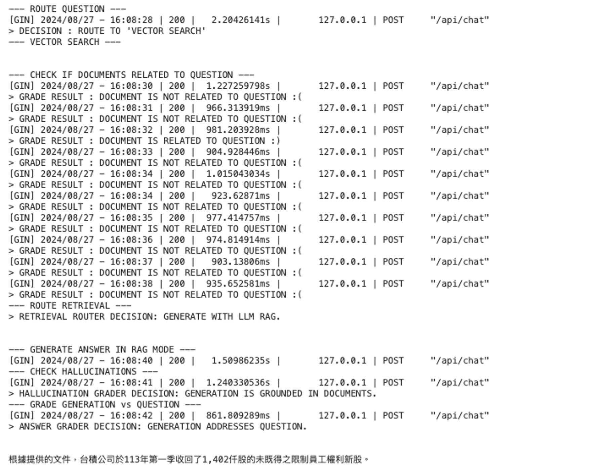
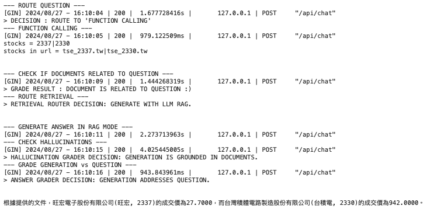
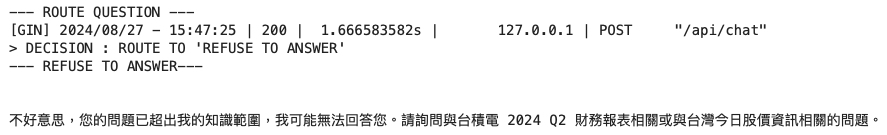
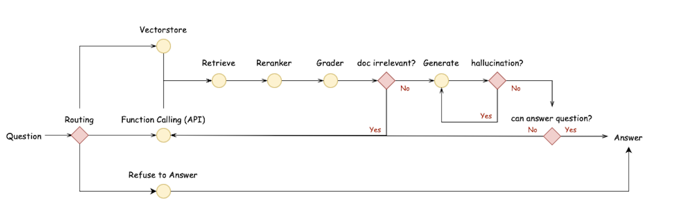

# LANGCHAIN ADAPTIVE RAG

> **Ask any questions related to `TSMC's 2024 Q2 financial report` or `the latest Taiwan stock market information` !**

## Use Cases
### - Vector Search Demo

### - Function Calling Demo

### - Refuse to Answer Demo

## Project Overview
> [!IMPORTANT]
> In this project, I have developed a `Langchain Adaptive RAG` with the following components and rag flow：
> - Vectorstore Data Source: **[2024 Q2 Financial Report of TSMC (2330) download from TWSE](https://doc.twse.com.tw/server-java/t57sb01?step=1&colorchg=1&co_id=2330&year=113&seamon=&mtype=A&)**
> - Function Calling API: **[TWSE Open API](https://openapi.twse.com.tw)**
> - Vectorstore: **Chroma DB**
> - Embedding Model: **jina-embeddings-v2-base-zh**
> - Large Language Model: **llama3.1 8b**
> - Large Language Model Framework: **Ollama**
> - Large Language Model Application Framework: **LangChain**
> - Controllable Agentic Workflows Framework: **LangGraph**
> - RAG Flow:
> - 

> > This **Langchain Adaptive RAG** allows users to ask any questions related to `TSMC's 2024 Q2 financial report` or `the latest Taiwan stock market information` in Traditional Chinese. If users ask questions not related to `TSMC's 2024 Q2 financial report` or `the latest Taiwan stock market information`, this **Langchain Adaptive RAG** would refuse to answer question.

## Potential Areas for Future Optimization
- [ ] Evaluate the effectiveness of Adaptive RAG: **RAGAs**
- [ ] Add Reranker to compare retrieval performance with the current version

## References
> The code in this project refers to some references mentioned below：
- [利用 Langchain 實作系列 RAG 進階流程：Query Analysis & Self-reflection](https://edge.aif.tw/application-langchain-rag-advanced/)
- [使用證卷交易所API爬取股票資訊](https://hackmd.io/@aaronlife/python-ex-stock-by-api?utm_source=preview-mode&utm_medium=rec)
- [使用繁體中文評測各家 Embedding 模型的檢索能力](https://ihower.tw/blog/archives/12167)
- [LangChain 怎麼玩？ LCEL (LangChain Expression Language) 篇，一定要認識的 LangChain 核心](https://myapollo.com.tw/blog/langchain-expression-language/)
- [chromadb error example](https://www.kaggle.com/code/toddgardiner/chromadb-error-example)
- [langgraph rag agent flow](https://github.com/langchain-ai/langgraph/blob/main/examples/rag/langgraph_rag_agent_llama3_local.ipynb)
- [solve the 'NotImplementedError' when using bind_tools with ChatOllama](https://github.com/langchain-ai/langchain/issues/21479)
- [how to create Document() object](https://github.com/langchain-ai/langgraph/blob/main/examples/tutorials/tool-calling-agent-local.ipynb)
- [differencebetween as_retriever and similarity_search](https://www.reddit.com/r/LangChain/comments/1ba77pu/difference_between_as_retriever_and_similarity/)
- [structured responses functional calling with langchain](https://medium.com/@mauryaanoop3/unleashing-structured-responses-functional-calling-with-langchain-ollama-and-phi-3-part-3-720b34203778)
